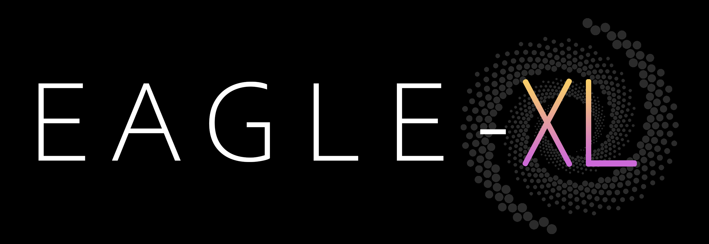

Eagle-XL Zoom Simulations
==========

EAGLE-XL is the next generation of cosmological simulations of periodic cubic volumes, created with the [SWIFT](https://github.com/SWIFTSIM) 
hydrodynamical code and its derivatives: [Velociraptor](https://github.com/SWIFTSIM/velociraptor-python) for halo finding 
and [Swiftsimio](https://github.com/SWIFTSIM/swiftsimio) for handling initial conditions and reading outputs.

Why zoom simulations?
------------
Zoom-in simulations are high-resolution runs of a given cosmological volume, where the particle resolution is highly
enhanced in correspondence of objects of interests (typically clusters or galaxy groups) and lowered elsewhere.
The zoomed halos are chosen to be isolated objects in one of the EAGLE-XL boxes at present redshift. Three halos
are currently selected within the mass range   1013 &leq; M200/M&odot; &leq; 1014.

Computing architecture
------------
Zooms are run with a single-node configuration and preferably on the `cosma7` computer cluster. The table below summarises
the properties of the computing clusters available to the Virgo Consortium. Visit the [COSMA-DiRAC pages](https://www.dur.ac.uk/icc/cosma/)
for more info. 

| Machine name       | Memory/node   | Cores/node  | CPU info                                       | Total nodes        |
| ------------------ |:-------------:|:-----------:| ---------------------------------------------- |:------------------:|
| Cosma 5            | 128 GB        |   16        |   2x Intel Xeon E5-2670 0 @ 2.60GHz            |   302              |
| Cosma 6            | 128 GB        |   16        |   2x Intel Xeon E5-2670 0 @ 2.60GHz            |   675              |
| Cosma 7            | 512 GB        |   28        |   2x Intel Xeon Gold 5120 @ 2.20GHz            |   452              |
| Cosma 8 (compute)  | 1 TB          |   64        |   2x AMD EPYC 7H12 @ 2.6GHz                    |   32               |
| Cosma 8 (monolith) | 4 TB          |   64        |   2x AMD EPYC 7702 @ 2.6GHz                    |   1                |

An important task of this project is to assess the possibility to run high-resolution zooms with SWIFT on one single node,
first with dark matter only, then with baryonic physics integrated. Due to the intensive use of memory, the final version
of the hydro simulations might make use of the `cosma8`'s large capacity nodes. 

Zoom pipeline \& guidelines
------------
The process of simulating useful zooms of a galaxy cluster (or group) comprises several stages, some of which are listed below.

- Generate of the (dark matter-only) cosmological parent box and the relative structure-finder output.
- Select of the (dark matter-only) halos from the parent box meeting specific criteria.
- Generate if the initial conditions for the zoom simulation:
    1. **Particle load:** Mask the high-resolution region;
    2. **Particle load:** Make the high-resolution grid;
    3. **Particle load:** Populate the high-resolution grid with particles using glass files;
    4. **Particle load:** Generate outer particles of low-resolution grid with growing skins;
    5. Construct the Panphasian parameter file and submission script;
    6. Run Panphasia on the particle load file to generate the Gaussian white noise field.
- Configure SWIFT and Velociraptor for dark matter-only zooms.
- Submit the initial condition file to SWIFT (with Velociraptor embedded) and run to the present redshift (dark matter-only).
- Analyse the dark matter-only snapshots and diagnose possible inconsistency between the parent and zoomed halos.
- Configure SWIFT and Velociraptor for zooms with hydrodynamics and subgrid.
- Submit the initial condition file to SWIFT (with Velociraptor embedded) and run to the present redshift (hydro and subgrid).
- The full hydro version of the zoom simulation is complete and ready to be analysed.

An alternative route consists in running SWIFT without Velociraptor embedded and then launch the structure finder on the snapshots
in the post-production phase. Since the SWIFT/Velociraptor integration for hydrodynamic runs is still under development, the current 
zoom pipeline operates with the stand-alone version of Velociraptor, called once the SWIFT job is completed.

The parent box
------------
Before running a high-resolution zoom simulation of a galaxy cluster (or group), we firstly need to select it from a cosmological environment.
EAGLE-XL's testing program includes the production of medium-sized dark matter-only cosmological boxes (size 300 Mpc) and the first set of
halos are selected from one of such boxes: `L0300N0564`.
Dark matter field-halos are identified using Velociraptor. Then, we select those which are found to be in a relatively isolated region of 
the box, defined by specific isolation criteria.

Performance toolkit
------------
The `/xl-zooms/performance` directory contains a suite of scripts for a simple diagnostics of the runtime. They are adapted from 
[Josh's `xl-pipeline`](https://github.com/JBorrow/xl-pipeline) and from [SWIFT's `tools` repository](https://github.com/SWIFTSIM/swiftsim/tree/master/tools). 

About
------------
For further information about the usage of codes in this repository, please contact [edoardo.altamura@manchester.ac.uk](mailto:edoardo.altamura@manchester.ac.uk).
These programs are provided and distributed without any warranty. 

If you are a fan of dark modes when viewing code, you can enable a dark theme for GitHub by adding [this extension](https://chrome.google.com/webstore/detail/github-dark-theme/odkdlljoangmamjilkamahebpkgpeacp) 
to your favourite web browser.

Logo design by Edo Altamura &copy; 2020